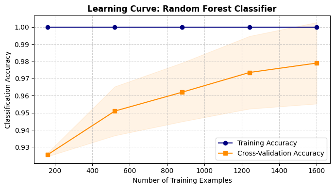
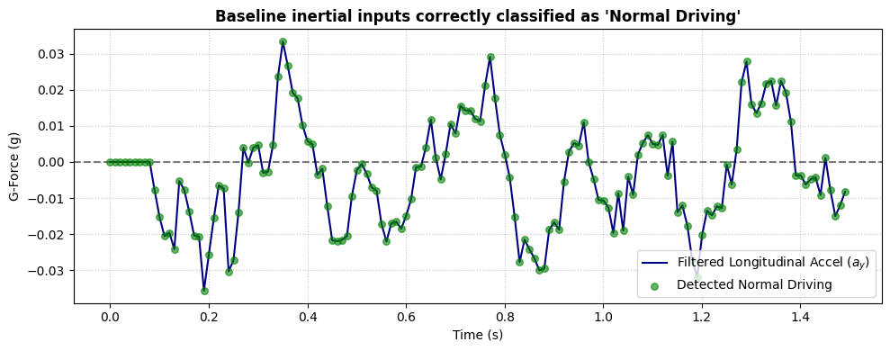
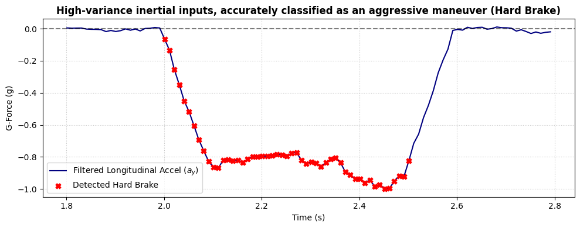

# Real-Time Driver Behavior Profiling Using Smartphone Sensors and Machine Learning

This repository implements a robust, hardware-independent solution for vehicle telematics using smartphone sensors and machine learning. The project addresses the high False Positive Rates (FPR) common in smartphone-based tracking by integrating Digital Signal Processing (DSP) with an ensemble classifier.

## 📌 Problem Statement
Traditional vehicle telematics rely on expensive OBD-II hardware, which limits scalability. While smartphone-based alternatives are cost-effective, they suffer from significant **data noise** caused by phone handling (e.g., dropping the phone), road irregularities, and engine vibrations. 

Conventional threshold-based systems often misidentify this noise as aggressive driving (e.g., hard braking or swerving), leading to high **False Positive Rates**. This incorrectly penalizes safe drivers in Usage-Based Insurance (UBI) models.

## 🚀 Proposed Solution
The system utilizes a hybrid framework that combines signal processing with machine learning to distinguish between actual driving maneuvers and sensor noise.

### 1. Data Acquisition & Preprocessing
- **Sensors:** Leverages standard accelerometer and gyroscope data.
- **DSP Pipeline:** Implements a **Low-Pass Rolling Mean Filter** (0.2-second window) to smooth high-frequency jitter while preserving sustained kinematic events like hard braking.

### 2. Feature Engineering
To ensure orientation independence (the phone's position in a pocket or mount shouldn't matter), the system extracts physics-based features:
- **Resultant Magnitude:** Combined force across axes.
- **Jerk:** The rate of change of acceleration, critical for identifying aggressive maneuvers.

### 3. Machine Learning Classifier
An ensemble **Random Forest Classifier** is used to categorize events into:
- Normal Driving
- Hard Brake
- Aggressive Turn
- Sudden Acceleration

### 4. Dynamic Safety Scoring
The kinematic classifications are translated into a **0–100 Safety Score**. The system functions like a "health bar," applying weighted penalties for risky events to provide granular risk profiling for insurance applications.

## 📊 Results and Plots

The model was evaluated against a high-fidelity physics simulation dataset with injected noise to test robustness.

### 1. Classification Performance
The system effectively distinguishes between baseline driving and high-variance aggressive maneuvers.

#### 2. Baseline: Normal Driving
The plot below shows how the system correctly identifies stable inertial inputs as "Normal Driving," even with minor sensor jitter.

#### 3. Aggressive Maneuver: Hard Braking
The model accurately captures the signature of a hard brake (significant negative G-force) and flags it as an aggressive event while ignoring transient noise.

#### 4. Performance Table

| Metric | Value |
| :--- | :--- |
| **Classification Accuracy** | **92.31%** |
| **F1-Score** | **92.17%** |
| **Precision** | **91.30%** |
| **Recall** | **93.33%** |

The system successfully mitigated smartphone sensor noise, effectively reducing false positives that would otherwise be flagged as aggressive driving.

## 🛠️ Tech Stack
- **Language:** Python
- **Libraries:** Scikit-learn, Pandas, NumPy, Matplotlib, Seaborn
- **Algorithms:** Random Forest, Digital Signal Processing (DSP)

## 🔮 Future Scope
- **Deep Learning Integration:** Exploring Recurrent Neural Networks (RNNs) like **LSTM** to better capture temporal patterns in driving data.
- **Real-World Deployment:** Transitioning from simulated datasets to real-world data collection for further validation.
- **Incentive Systems:** Integrating financial reward or penalty models into the scoring system to actively encourage behavioral change.

---
*Developed as part of M.Tech. coursework at GITAM University.*
